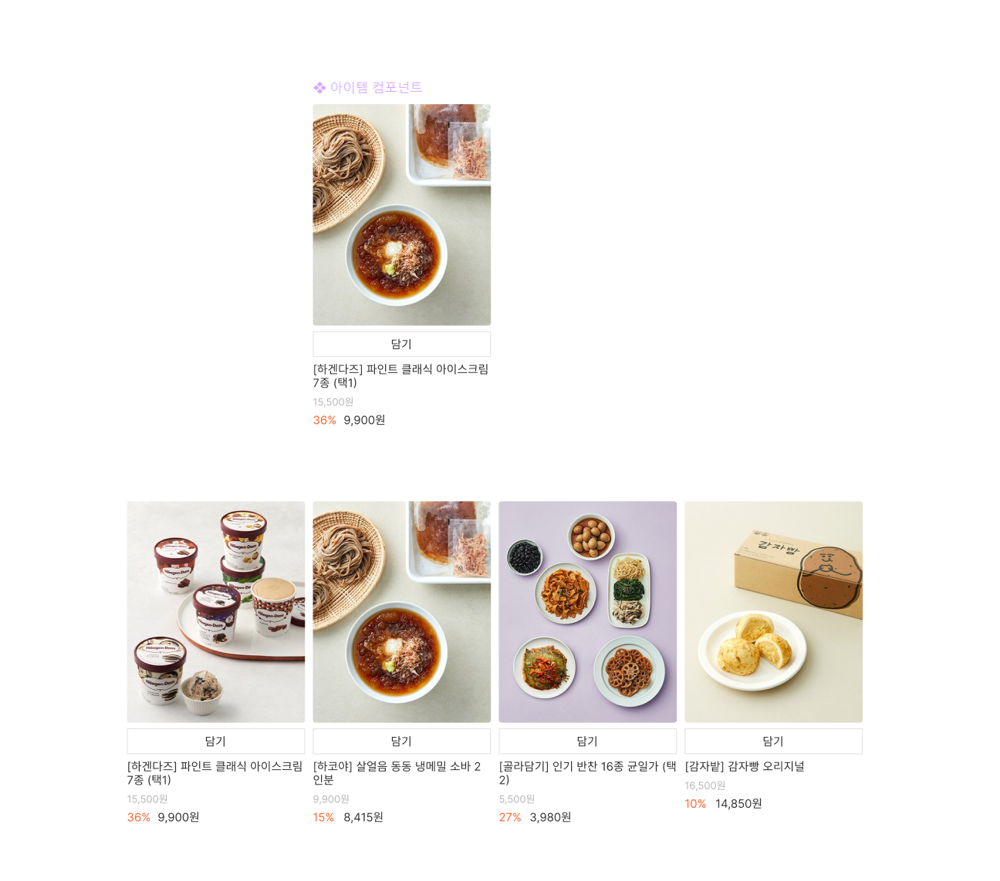

## 7월 26일 과제

아토믹 컴포넌트 개발

- 환경 구성 (vite + react)
- data값에 따라 렌더링 화면 변화
- 컴포넌트와 페이지 구분

---

환경 구성 하는 부분에서 꽤나 많은 시간을 잡아먹었습니다

아직까지도 환경구성 및 깃, 피그마는 너무나도 어색하고
많이 써보지않은 리액트도 적응하려면 꽤나 많은 시간과 노력이 필요할거 같습니다

저의 코드를 보시고
부족한 점과 칭찬할 부분에 대해서
조언을 남겨주시면 감사하겠습니다

### 피드백

- ⚠️ Figma 컴포넌트에 오토 레이아웃을 사용하지 않았네요.
- ⚠️ 주언어 설정이 영어에요. 한국어로 설정해야겠죠?
- ⚠️ 문서 제목이 Vite 초기 설정 그대로네요. 주제에 맞게 작성하세요.
- ⚠️ <noscript> 요소가 없네요. 최소한의 접근성을 준수해주세요.
- ⚠️ Product 컴포넌트의 JSX에는 key 속성을 설정하지 않아도 되요.
- ⚠️ main.jsx 파일은 src 폴더 안에 위치하는 것이 권장됩니다.
- ⚠️ 한글 이름 파일은 문제를 발생시킬 가능성이 있어요. 영어로 작성해보세요.
- ⚠️ ProductLink 컴포넌트 <a> 요소에 href 속성이 누락되어 있네요.
- ⚠️ 이미지의 대체 텍스트와 인접한 내용이 중복됩니다.

피드백 업데이트 7월 27일
