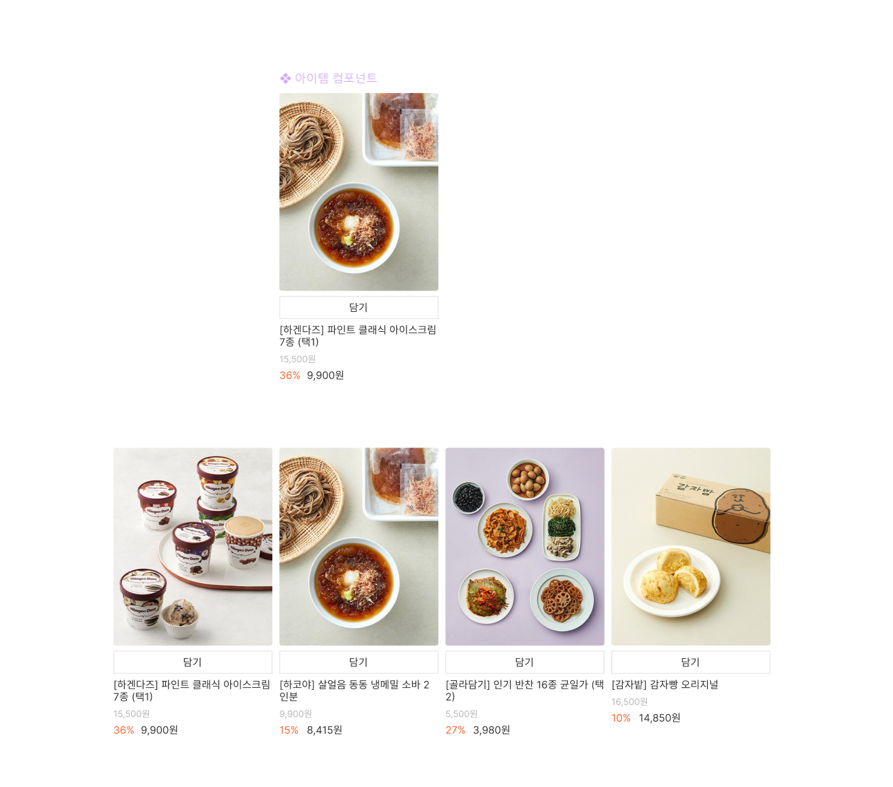

## 7월 26일 과제

아토믹 컴포넌트 개발

- 환경 구성 (vite + react)
- data값에 따라 렌더링 화면 변화
- 컴포넌트와 페이지 구분

---

환경 구성 하는 부분에서 꽤나 많은 시간을 잡아먹었습니다

아직까지도 환경구성 및 깃, 피그마는 너무나도 어색하고
많이 써보지않은 리액트도 적응하려면 꽤나 많은 시간과 노력이 필요할거 같습니다

저의 코드를 보시고
부족한 점과 칭찬할 부분에 대해서
조언을 남겨주시면 감사하겠습니다
